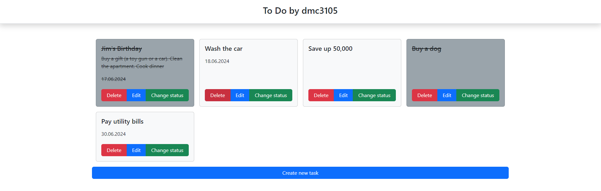

# To Do by dmc3105

"Todo by dmc3105" is a web application that uses server-side rendering and implements CRUD operations to keep track of a list of personal tasks.
***
### Java version
Java 21
### Build system
Apache Maven 3.9.6
### Database
MySQL Community Server Ver 8.0.37
***
## Build and Run

### Database creation
You can use **create.sql** script to create database and tables
### Running using spring-boot
``
.\mvnw spring-boot:run
``