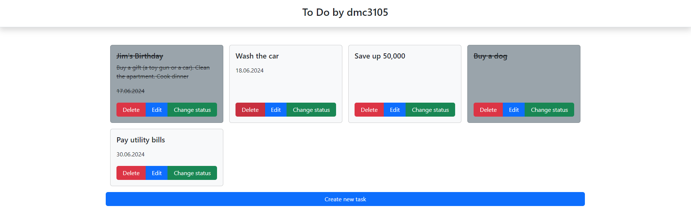

# To Do от dmc3105

"To do by dmc3105" - это веб-приложение, которое использует рендеринг на стороне сервера и реализует CRUD-операции для отслеживания списка задач
***
### Версия Java
Java 21
### Системы сборки
Apache Maven 3.9.6
### База данных
MySQL Community Server Ver 8.0.37
***
## Сборка и запуск

### Создание базы данных
Вы можете использовать **create.sql** скрипт для создания базы данных и таблиц
### Запуск используя spring-boot
``
.\mvnw spring-boot:run
``